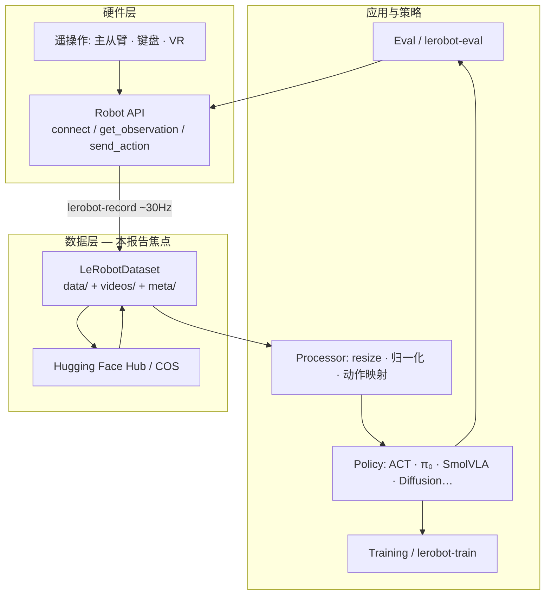
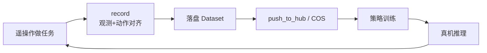
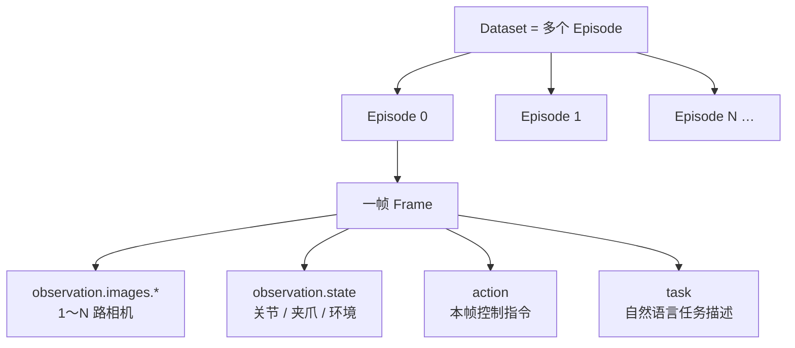
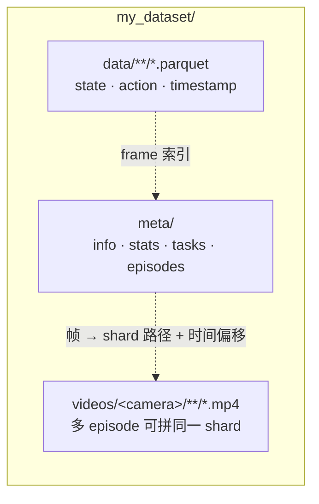
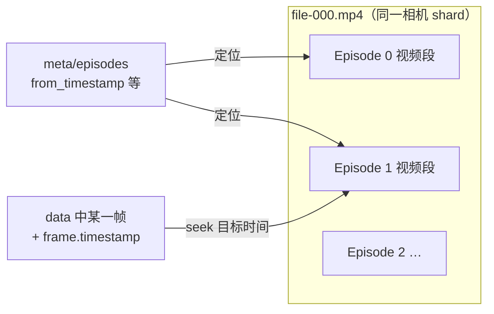
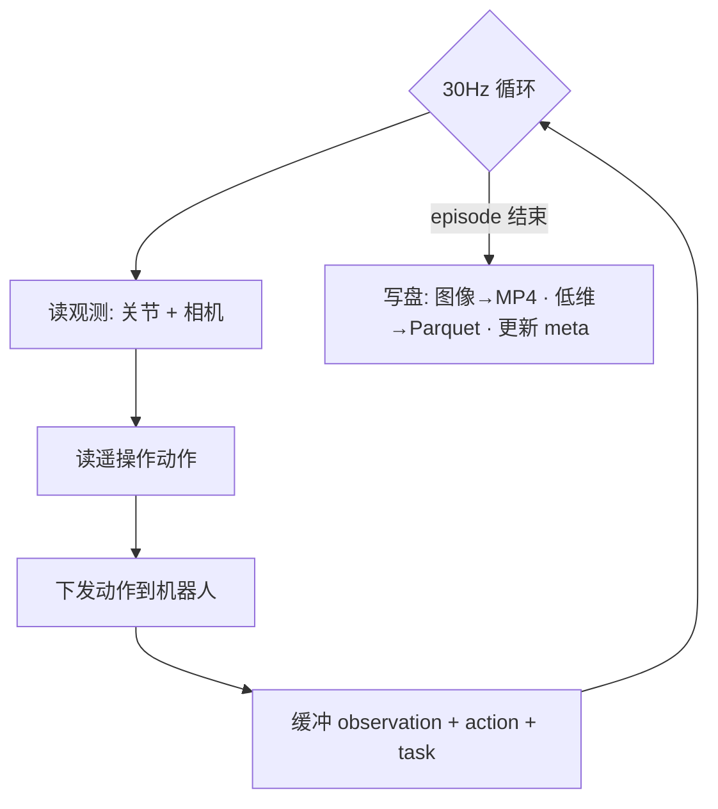
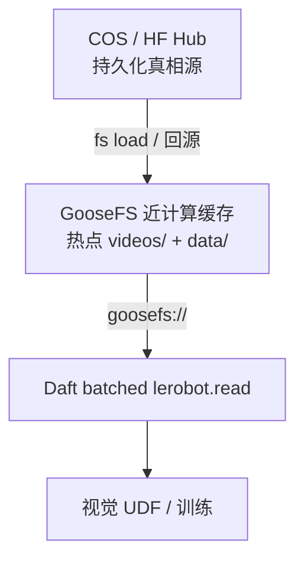
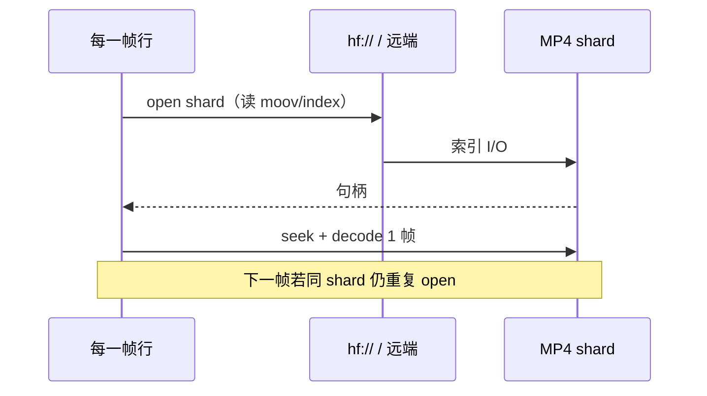
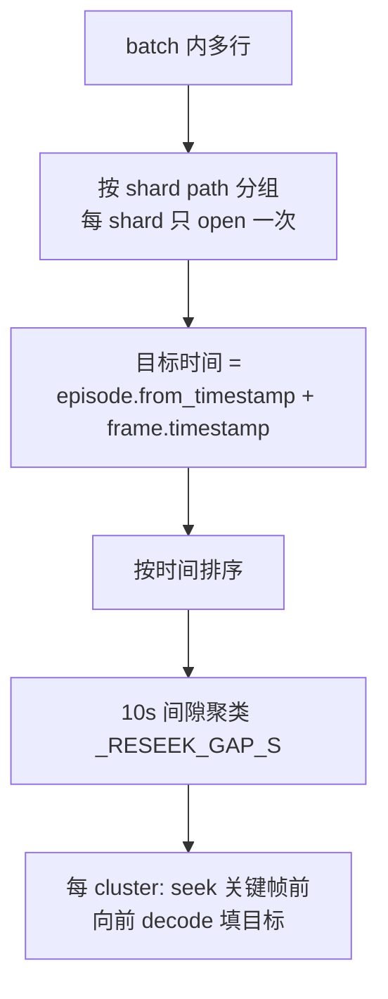
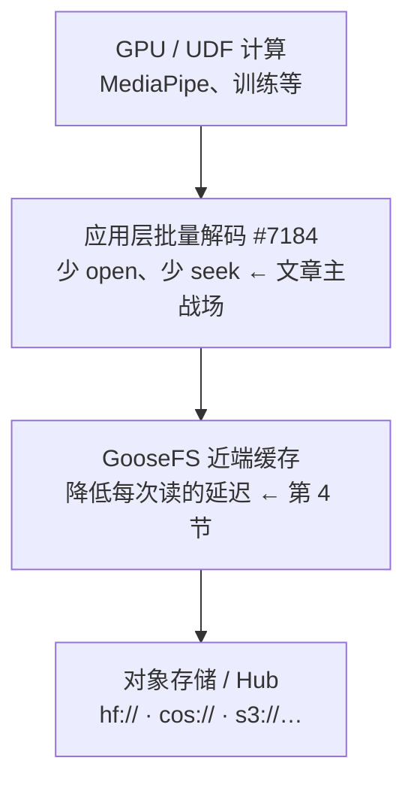

# 调研分析：LeRobot 解码加速机制与 GooseFS 在具身场景的协同

> **日期**: 2026-08-04（2026-08-05 补充 §2 LeRobot / Dataset 背景）  
> **状态**: 调研草稿（非产品对外文档）  
> **关联**: [Eventual 博客 — LeRobot reader 最高约 15×](https://www.eventual.ai/blog/how-we-made-our-lerobot-video-reader-up-to-15x-faster) · [Daft #7184](https://github.com/Eventual-Inc/Daft/pull/7184) · [Daft #7267](https://github.com/Eventual-Inc/Daft/pull/7267) · [GooseFS 连接器文档](../connectors/goosefs.md) · [腾讯云 GooseFS 具身智能场景](https://cloud.tencent.com/document/product/1424/122098)

## 1. 范围与材料说明

本报告回答四件事：

1. **LeRobot 是什么**、`LeRobotDataset` 在磁盘上如何组织（与训练闭环的关系）；
2. 文章（及对应开源实现）是如何把 LeRobot 远程视频读加速的；
3. Daft 已支持 `goosefs://` 读/写后，在 LeRobot 具身流水线里能否、如何用 GooseFS 再加速；
4. 能否借 [#7267](https://github.com/Eventual-Inc/Daft/pull/7267) 的 hand-tracking A/B 基准来验证 GooseFS 收益。

**材料来源**

| 类型 | 说明 |
|---|---|
| 本地整理稿（`~/Desktop/goosefs/LeRobot/`） | 论文摘要、专家级剖析、源码架构解读、第 2 课 Dataset/GHRC、SO-ARM101 入门等微信 PDF，作为「LeRobot / Dataset」背景主源。PDF 多为微信长文导出，**几乎无可复用架构插图**；下文用 Mermaid 示意图代替截图，便于阅读与维护 |
| Eventual / Daft | 博客、[#7184](https://github.com/Eventual-Inc/Daft/pull/7184)、[#7267](https://github.com/Eventual-Inc/Daft/pull/7267)、`benchmarking/lerobot/` |
| 官方文档 | [Hugging Face LeRobot](https://huggingface.co/docs/lerobot)、[Dataset v3](https://huggingface.co/docs/lerobot/lerobot-dataset-v3)、[arxiv:2602.22818](https://arxiv.org/pdf/2602.22818) |
| 腾讯云 | [GooseFS 具身智能场景](https://cloud.tencent.com/document/product/1424/122098) |

**关于加速相关微信原文** [`https://mp.weixin.qq.com/s/9BHg0OVuLaFGgk6yiiDfdQ`](https://mp.weixin.qq.com/s/9BHg0OVuLaFGgk6yiiDfdQ)：抓取时触发微信验证墙。结合 #7267、仓库基准与 Eventual 同期文章（手部追踪 **44.8s → 9.8s**、全量 632 帧约 **15×**）还原加速机制；GooseFS 产品表述可与第 4 节腾讯云文档交叉阅读。

---

## 2. LeRobot 是什么？Dataset 结构与训练闭环

> 本节综合本地 PDF（论文摘要 / 专家剖析 / 源码架构 / Xbotics 第 2 课）与 HF 官方文档，给后续「为什么要加速视频读、GooseFS 该缓存什么」提供统一语境。

### 2.1 一句话定位

**LeRobot**（仓库 [`huggingface/lerobot`](https://github.com/huggingface/lerobot)）是 Hugging Face 推出的、面向**真实世界机器人学习**的开源全栈库（论文标题：*LeRobot: An Open-Source Library for End-to-End Robot Learning*，arxiv [2602.22818](https://arxiv.org/pdf/2602.22818)）。

它要解决的核心矛盾是：**机器人学习生态高度碎片化**——中间件按机型定制、数据集格式不统一、贡献难以复现与跨机复用。LeRobot 用统一 Python 接口把链路打通：

| 能力 | 含义 |
|---|---|
| 统一机器人接入 | 与硬件无关的 `Robot` 抽象：`connect` / `get_observation` / `send_action` / `calibrate` / `disconnect`；从低成本臂（SO-100 / SO-101，约 €114）到人形（Reachy 2、Unitree G1 等） |
| 标准化数据集 | **LeRobotDataset**：Parquet（状态/动作）+ MP4（相机）+ meta，托管于 Hugging Face Hub，支持流式与可视化 |
| 策略算法 | 纯 PyTorch：模仿学习（ACT、Diffusion Policy…）、RL（HIL-SERL 等）、VLA（π₀、SmolVLA、GR00T…） |
| 可扩展闭环 | 采集 → 训练 → 异步推理部署 → 回采；强调随数据量/算力扩展，而不是手工拼系统 |

命名上无无官方全拼：社区常理解为法语 *Le*（HF 总部法国）+ Robot，或 *Learning-enabled Robot*。

### 2.2 分层架构（自底向上）

本地「专家级剖析 / 源码架构」一文把栈拆成五层，和加速讨论相关的重点在 **Data Layer**：



| 层 | 目录 / 入口 | 作用 |
|---|---|---|
| Hardware | `robots/` | 电机、相机、主从臂、键盘/VR |
| Data | `datasets/` | 录制、校验、Hub 上下载 |
| Processor | `processor/` | 图像 resize、状态归一化、动作映射 |
| Policy | `policies/` | ACT / π₀ / SmolVLA / Diffusion … |
| Train / Eval | `lerobot-train` · `lerobot-eval` | 配置驱动训练、评估与回放 |

典型闭环（采集 → 训练 → 部署 → 回采）：



**训练语义**：每一帧是成对的「观测 → 动作」。输入通常是多路图像 + `observation.state` + 自然语言 `task`；输出是当帧 `action`。标签来自遥操作/主从臂/仿真，由 record 循环自动对齐，而不是人工逐帧标注。

### 2.3 核心概念：episode 与一帧里有什么

| 概念 | 含义 |
|---|---|
| **Episode** | 机器人从任务开始到结束的一次完整记录（如「抓方块放进篮子」整段） |
| **Dataset** | 多个 episode 的集合 |
| **一帧** | 通常四类：多路图像、`observation.state`、`action`、`task` |



人形示例（GHRC / Walker S2）：4 路 RGB（头左/头右 + 左右手腕）、**20 维 action**、30 FPS、**LeRobotDataset V3**；不同任务的 `observation.state` 维度可不同，但磁盘布局仍是同一套 `data` / `videos` / `meta`。

### 2.4 磁盘上的三大支柱（记住这一句）

> **低维进 Parquet，相机进 MP4，说明书进 meta。**

与采集设备无关：SO101 真机、Isaac Sim 仿真、UMI 手套，落盘都应对齐到同一结构，训练代码才可复用。



#### 目录树（v3 形态）

```text
my_dataset/
├── data/
│   └── chunk-000/
│       └── file-000.parquet      # 帧级：state / action / timestamp / episode 索引等
├── meta/
│   ├── info.json                 # fps、特征 schema、版本、相机名等
│   ├── stats.json                # 归一化用均值/标准差等
│   ├── tasks.parquet             # 任务描述索引
│   └── episodes/                 # 每个 episode 的长度、边界、视频时间偏移等
│       └── **/*.parquet
└── videos/
    └── observation.images.<cam>/ # 按相机一路一个子树
        └── chunk-000/
            └── file-000.mp4      # 多 episode 可拼进同一 MP4 shard
```

| 层 | 路径 | 存什么 | 为什么这样存 |
|---|---|---|---|
| 帧表 | `data/**/*.parquet` | 关节状态、动作、时间戳、episode/frame 索引 | 列式、可筛选、适合随机访问低维特征 |
| 视频 | `videos/<camera>/**/*.mp4` | 相机画面；**不是**逐帧散落的 PNG | 压缩比高；v3 常把多 episode **首尾相接**打进同一 shard |
| 元数据 | `meta/` | schema、统计、任务表、episode 边界与**视频内时间偏移** | 训练归一化、按 episode 切片、把帧映射到 MP4 内 seek 点 |

官方说明见 [LeRobot Dataset v3](https://huggingface.co/docs/lerobot/lerobot-dataset-v3)。相对早期「一 episode 一视频文件」的写法，v3 的 **MP4 shard + episode 时间偏移** 更利于大规模托管与顺序读，但也让「远程按帧乱序解码」更容易变成**重复 open/seek**——这正是第 3 节 Daft 批量解码要解决的问题。

v3 shard 与帧的关系（示意）：



#### 与 Daft 的映射

[`daft.datasets.lerobot.read`](../datasets/lerobot.md) 把上述布局读成 **一帧一行** 的 DataFrame；`load_video_frames=...` 时再按时间戳从对应 MP4 shard 解出图像列。路径可以是本地、`hf://`、或本报告关注的 `goosefs://`。

### 2.5 采集侧：`lerobot-record` 在写什么

无论真机主从臂还是仿真键盘，record 本质是固定频率循环（文中强调 **~30 Hz**）：



CLI 参数可粗分为三组：**robot**（从臂+相机）、**teleop**（主臂/键盘）、**dataset**（repo 名、任务文案、episode 数/时长、是否上传）。

### 2.6 为什么这对 GooseFS / 解码加速重要

| 数据 | 体积与访问模式 | 缓存 / 加速含义 |
|---|---|---|
| `meta/` + `data/` Parquet | 相对小；启动时读 schema、episode 表、帧索引 | 适合常驻本地或 GooseFS；成本通常不是主瓶颈 |
| `videos/**/*.mp4` | **体积主体**；训练/视觉 UDF 反复按时间戳随机/准随机读 | 热数据集应 **`fs load` 进 GooseFS**；应用层应 **按 shard 批量 open+seek**（第 3 节），避免每帧远程 open |



具身闭环：**COS 持久化 + GooseFS 热读 + Daft batched reader + UDF**——存储层减延迟，应用层减次数。

---

## 3. 文章加速机制详解（应用层：按 shard 批量解码）

### 3.1 背景：LeRobot v3 的存储形态（与 §2.4 对应）

细节见 **§2.4**。加速相关的要点只有三条：

1. 帧表在 `data/**`，视频在 `videos/` 的 **MP4 shard**；
2. 多 episode 可拼进同一 MP4，靠 `meta/episodes` 里的时间偏移定位；
3. Daft `lerobot.read` 一帧一行，解码时必须把「帧 → (shard 路径, 时间戳)」解析对。

### 3.2 瓶颈：远程「每帧一次 open」

早期实现是 **per-row UDF**：每一行都 `open` 自己的 MP4 shard。打开容器必须先读 **index / moov**（时间戳 → 字节偏移）。在 `hf://` 等远程路径上，这等于：

- 每帧一次网络往返式索引读取；
- 即使相邻帧落在同一 shard，也重复支付 open + 解析成本；
- 实测约 **~3s/帧**，耗时随帧数近似线性上升。



这是典型的 **远程随机小 I/O + 重复元数据读取**，而不是单纯「解码算力不够」。

### 3.3 修复：`@daft.func.batch` 按 shard 计划解码（#7184）

实现见 [`daft/datasets/lerobot.py`](../../daft/datasets/lerobot.py)。核心思路：batch UDF（默认 `_DECODE_BATCH_SIZE = 16`）收到一批行后：



文字版：

```text
batch 内行
  → 按 shard path 分组（每 shard 只 open 一次）
  → 目标时间 = episode.from_timestamp + frame.timestamp
  → 按时间排序，用 10s 间隙聚类（_RESEEK_GAP_S）
  → 每个 cluster：seek 到最早目标前的关键帧，再向前 decode，
     为每个目标保留最近帧，越过最晚目标 + tail 后停止
```

**为什么要聚类而不是整 shard 一把梭？**

- seek 会回到前一个关键帧再解，小间隙「一路解过去」往往比反复 seek 便宜；
- 同一 shard 里不同 episode 可能相隔数分钟，硬解间隙会浪费算力并触达 `_DECODE_FRAME_BUDGET`。

输出与旧 per-row 解码 **字节级一致**（benchmark 用像素 / detection 校验）。

### 3.4 量化结果（仓库已记录）

机器：Apple M4 Max 36 GB；远程 `hf://`。

| 场景 | 原始 | batched | 倍数 / 备注 |
|---|---|---|---|
| 8 帧 decode | 25.0s | 3.9s | ~6×；曲线由线性变平坦 |
| 6 个公开数据集 ×16 帧 | — | — | **4–13×**，像素一致 |
| egodex-test 全量 632 帧 | 1750.7s (~29 min) | 115.8s (<2 min) | **~15×** |
| Hand-tracking（12 帧 + MediaPipe，#7267） | **44.8s** | **9.8s** | 端到端 ~4.6×，检测结果一致 |

要点：加速来自 **减少重复远程 open / 索引读取与无效 seek**，属于 **应用侧 I/O 调度优化**，不依赖特定云缓存产品。

### 3.5 加速层次小结



文章解决的是中间「少读几次」；GooseFS 解决的是「每次读更便宜」。

---

## 4. GooseFS 加速机制（存储层：近计算分布式缓存）

### 4.1 产品定位（腾讯云）

[GooseFS / GooseFSx](https://cloud.tencent.com/document/product/1424) 是面向 COS 等对象存储的数据加速层：热数据靠近计算节点缓存，冷数据仍落在低成本对象存储，形成「一份数据、冷热分层、按需流动」。

公开应用场景明确包含 **[具身智能](https://cloud.tencent.com/document/product/1424/122098)**：加速清洗、训练、仿真；与 COS 闭环流转，降本增效。

典型收益来源：

| 机制 | 作用 |
|---|---|
| 近端分布式缓存 | 热点 MP4 / Parquet 命中后走内网高带宽、低延迟 |
| 元数据 / 列表加速 | 降低大规模 `list`、小文件元数据抖动（具身数据集常见） |
| 与 COS 数据流动 | 预热、沉降、按需加载，避免 GPU 空等远端 |
| 多协议入口 | HDFS / POSIX / 以及 Daft 侧原生 `goosefs://` gRPC |

### 4.2 Daft 侧能力

Daft 通过 OpenDAL `services-goosefs` **原生 gRPC** 访问 GooseFS（无需 HDFS/JVM 网关），协议为：

```text
goosefs://{MASTER_HOST}:{MASTER_PORT}/{PATH}
```

配置见 [`GooseFSConfig`](../connectors/goosefs.md) / `IOConfig(goosefs=...)`，支持：

- HA `master_addr`、simple / nosasl 认证、`from_env()`；
- `write_type`：`must_cache` / `cache_through` / `through` / `async_through`；
- 读：`read_parquet` / `read_csv` / `read_json` / glob / `open_file`；
- 写：`write_parquet` 等。

`lerobot.read` 已接受任意远程目录 URI + `io_config`（文档示例写的是 `s3://` / `hf://`，但路径拼接是通用的）。对非 `org/name` 形式的 URI，`_normalize_dataset_root` 原样保留，因此 **`goosefs://...` 在 I/O 栈打通的前提下可直接作为 dataset root**。

---

## 5. 具身 / LeRobot 场景：GooseFS 能否加速？怎么接？

### 5.1 结论（先说清楚）

**可以加速，且与 #7184 批量解码正交、可叠加。**

| 优化 | 主要消掉的成本 | 单独用 | 叠加用 |
|---|---|---|---|
| 批量解码（#7184） | 重复 open / 索引 / 多余 seek | 远程 Hub 上已有 4–15× | 仍保留 |
| GooseFS 缓存 | 每次真实字节读的网络延迟与吞吐 | 对「已批量但仍要从远端拉大 MP4」仍有收益 | 近端命中后，单次 open 更便宜，端到端再降 |

注意边界：

- 若工作负载已几乎 **纯 CPU 解码 / MediaPipe**（数据已在本地 NVMe），GooseFS 增益会变小；
- 若仍从 **跨公网 `hf://` 或远距离 COS** 拉 1080p MP4，GooseFS（或先镜像到集群旁缓存）收益更明显；
- **冷启动首次 miss** 仍要回源，应用侧应做预热（preload / 主动读一遍热点 shard）。

### 5.2 推荐数据路径（具身闭环）

```text
采集 / 仿真 / 标注产物
        │
        ▼
   COS（持久化、低成本）  ←→  GooseFS（热缓存 / 训练近端）
        │                         │
        │                         ├── Daft lerobot.read(goosefs://...)
        │                         │      + load_video_frames（批量解码）
        │                         ├── UDF：hand tracking / reward / 清洗
        │                         └── 写回 goosefs:// → cache_through → COS
        ▼
   训练 / 仿真集群（Ray / 多机）
```

与腾讯云「具身智能」叙事一致：清洗 → 训练 → 仿真共用一份湖存，热路径走加速器。

### 5.3 Daft 接入示例（读）

```python
import daft
from daft.datasets import lerobot
from daft.io import IOConfig, GooseFSConfig

io_config = IOConfig(
    goosefs=GooseFSConfig(
        master_addr="10.0.0.1:9200",  # HA 可用逗号分隔多 master
        auth_type="simple",
        auth_username="alice",
    )
)
daft.set_planning_config(default_io_config=io_config)

# 数据集需已按 LeRobot v3 布局落在 GooseFS 命名空间（可从 COS/Hub 预热）
ROOT = "goosefs://10.0.0.1:9200/datasets/pepijn223/egodex-test"

df = lerobot.read(
    ROOT,
    io_config=io_config,
    load_video_frames="observation.image",
)
```

### 5.4 写路径（中间结果 / 精炼集）

```python
df.write_parquet(
    "goosefs://10.0.0.1:9200/curated/egodex-hands/",
    io_config=IOConfig(
        goosefs=GooseFSConfig(
            master_addr="10.0.0.1:9200",
            write_type="cache_through",  # 缓存 + 同步落 UFS/COS
        )
    ),
)
```

| `write_type` | 适用 |
|---|---|
| `cache_through` | 默认稳妥：可读加速 + 持久化 |
| `async_through` | 吞吐优先的训练日志 / 可重建产物 |
| `must_cache` | 纯临时热数据（不落 UFS，慎用） |
| `through` | 基本不走 worker 缓存，直接 UFS |

### 5.5 与 LeRobot 流水线各阶段的匹配度

| 阶段 | I/O 特征 | GooseFS 价值 | 叠加批量解码 |
|---|---|---|---|
| Episode 过滤 / Parquet scan | 中等顺序读 + list | 高（元数据与列存缓存） | 无关 |
| 视频帧解码训练预处理 | 大文件顺序/半随机读 | **高**（MP4 shard 命中） | **高** |
| Hand-tracking / reward UDF | 解码后偏 CPU/GPU | 间接（缩短喂帧等待） | 高 |
| Checkpoint / 精炼集写回 | 大吞吐写 | 高（`cache_through`） | 无关 |
| 纯本地已缓存小样本实验 | 几乎无本地盘 | 低 | 仍有（若曾用远程） |

### 5.6 实践建议

1. **先镜像再测**：把目标 LeRobot 树（至少 `meta/` + 用到的 `data/` + `videos/`）同步到 GooseFS，再 `lerobot.read("goosefs://...")`。
2. **预热**：正式计时前对热点 shard 做一次顺序读或 GooseFS 侧 preload，分开报告 cold / warm。
3. **分布式**：Ray worker 需能解析同一套 `GooseFSConfig` / 环境变量（见连接器文档关于 driver vs worker 凭证的说明）。
4. **文档小缺口**：`lerobot` 对外 docstring 尚未显式列出 `goosefs://`；功能上走通用远程 URI，建议后续补一句示例以免误用。

---

## 6. 用 #7267 验证 GooseFS 加速？可行，但不能原样复用

### 6.1 #7267 实际测的是什么

[#7267](https://github.com/Eventual-Inc/Daft/pull/7267)（已合入）在 `benchmarking/lerobot/` 增加 **hand-tracking 下游负载 A/B**：

- 负载：`lerobot.read` 解 12 帧 + MediaPipe `track_hands` + materialize；
- 对比维：`lerobot.py` **原始 per-frame open** vs **batched**（通过 `git show` 换文件）；
- 存储：固定 **远程 `hf://`**；
- 正确性：两侧 `n_hands` 一致；
- 结果：44.8s → 9.8s。

它验证的是 **#7184 应用层优化**，**不是** GooseFS vs COS/Hub。

### 6.2 能否借用来验 GooseFS？

**方法论可复用，对照轴必须改。**

| 维度 | #7267 现状 | GooseFS 验证应改成 |
|---|---|---|
| A/B 自变量 | reader 实现（orig vs batched） | **存储后端 / 缓存状态** |
| 建议固定 | — | reader **固定为当前 batched**（避免混杂因素） |
| URI | HF repo id → `hf://` | `cos://` 或冷 `hf://` vs `goosefs://`（warm） |
| 正确性 | detection 一致 | 同样可比；或与 `real_datasets.py` 做像素 hash |
| 规模 | 12 帧 demo | **建议加长**：100+ 帧 / 全量 shard，否则 MediaPipe 易淹没 I/O 差 |

推荐对照矩阵（2×2 更干净）：

```text
              hf/cos 直读          GooseFS warm
per-frame       T00                  T01        ← 可选，证明「缓存也救不了错误 open 模式」
batched         T10                  T11        ← 主结论：GooseFS 增量
```

主 KPI：

1. **端到端 wall time**（与 #7267 相同 JSON 结构即可）；
2. **可选**：仅 decode 阶段耗时（去掉 MediaPipe），更纯净反映 I/O；
3. **cold vs warm** 各跑一轮，避免把首次回源算进「稳态加速」。

### 6.3 最小改动落地（基于现有 harness）

在不推翻 #7267 结构的前提下：

1. 扩展 `hand_tracking.py`：`DATASET` / `IOConfig` 可由环境变量或 CLI 注入，例如：
   - `DATASET=goosefs://master:9200/path/egodex-test`
   - `DAFT_IO_CONFIG` 指向 GooseFS；
2. 新增 `run_hand_tracking_goosefs.sh`：
   - 固定当前树（batched）；
   - 依次跑 `BACKEND=hf` 与 `BACKEND=goosefs`（或 `cos` vs `goosefs`）；
   - 复用 `--chart` 画「直读 vs GooseFS」而非「orig vs batched」；
3. 大数据集复用 `real_datasets.py` / `sweep.py` 同一套 URI 切换，看 16 帧 / 100 帧 / full 曲线。

伪代码级驱动：

```bash
# Warm GooseFS path (dataset already cached)
DATASET=goosefs://$MASTER/datasets/egodex-test \
  .venv/bin/python benchmarking/lerobot/hand_tracking.py /tmp/ht_goosefs.json

# Baseline: same layout on COS or Hub
DATASET=cos://bucket/datasets/egodex-test \
  .venv/bin/python benchmarking/lerobot/hand_tracking.py /tmp/ht_cos.json

.venv/bin/python benchmarking/lerobot/hand_tracking.py --chart \
  /tmp/ht_cos.json /tmp/ht_goosefs.json
```

（需小改脚本以支持非 HF repo id 的 `DATASET` 与 `io_config`；当前脚本写死了 `pepijn223/egodex-test`。）

### 6.4 预期与判读

| 现象 | 解读 |
|---|---|
| batched + GooseFS warm ≪ batched + 远端直读 | GooseFS 对具身读路径有效，与文章优化叠加 |
| 两者接近 | 瓶颈已不在存储（本地已快 / 帧太少 / UDF 占主导）→ 加大数据量或拆 decode-only 计时 |
| cold GooseFS ≈ 直读，warm 明显更好 | 符合缓存模型；发布数字应标注 warm，并描述预热方式 |
| GooseFS 反而更慢 | 查挂载/网络路径、未命中反复回源、或 gRPC 配置（超时、并发） |

### 6.5 风险与前置条件

- 需要可用的 GooseFS 集群 + 与计算同地域的网络；
- 数据集布局必须保持 LeRobot v3；
- CI 默认无 GooseFS：该基准应标为 **manual / integration**，与现有 `benchmarking/lerobot` 一样偏本地/专项；
- #7267 的 `run_hand_tracking.sh` 仍适合回归「批量解码正确性」；GooseFS 应 **另开 driver**，避免一个脚本混两个自变量。

---

## 7. 综合结论

1. **LeRobot**：HF 开源端到端机器人学习栈；**LeRobotDataset** 用 `data`（Parquet）+ `videos`（MP4 shard）+ `meta` 统一多源采集，训练吃的是帧级「观测→动作」对（详见 §2）。
2. **文章加速本质**：把远程 MP4 从「每帧 open」改为「每 batch 按 shard 分组 + 时间聚类 seek」，消掉重复索引网络开销；公开数据上约 **4–15×**，hand-tracking 端到端约 **44.8s → 9.8s**（[#7267](https://github.com/Eventual-Inc/Daft/pull/7267)）。
3. **GooseFS 加速本质**：把热点（尤其 `videos/`）放到计算旁缓存，降低每次真实读的延迟与回源成本；腾讯云已将其标为具身智能数据闭环组件。
4. **二者关系**：互补。批量解码减少「读几次」；GooseFS 降低「每次读多贵」。具身生产路径建议：**COS 持久化 + GooseFS 热读 + Daft batched `lerobot.read` + UDF**。
5. **验证**：**不能**指望原版 #7267 直接给出 GooseFS 数字；**可以**复用其下游负载、计时 JSON、正确性检查与 chart 流程，把 A/B 轴改成 **直读 vs `goosefs://`（warm）**，并加大帧数或增加 decode-only 计时，才能可信度量存储加速。

---

## 8. 参考链接

### LeRobot / Dataset 背景（本地 PDF 对应原文）

- 论文：[LeRobot: An Open-Source Library for End-to-End Robot Learning](https://arxiv.org/pdf/2602.22818)（摘要稿：`论文摘要：LeRobot——面向端到端机器人学习的开源库.pdf`）
- 微信： [LeRobot 之专家级剖析](https://mp.weixin.qq.com/s/-uyIUN8x6dJLCWkVfLxb-A) · [源码架构解读](https://mp.weixin.qq.com/s/zvUWyIrzeHMv6-LILmTTSQ) · [第 2 课：LeRobotDataset 到 GHRC](https://mp.weixin.qq.com/s/seZN-trz1c8axr_6Vttf3g) · [SO-ARM101 入门](https://mp.weixin.qq.com/s/tb1OT2hMZ1m2FdQbJz-3Ag)
- 官方：[Hugging Face LeRobot 文档](https://huggingface.co/docs/lerobot) · [Dataset v3](https://huggingface.co/docs/lerobot/lerobot-dataset-v3) · 仓库 [huggingface/lerobot](https://github.com/huggingface/lerobot)

### 解码加速与 GooseFS

- Eventual: [How we made our LeRobot video reader up to 15× faster](https://www.eventual.ai/blog/how-we-made-our-lerobot-video-reader-up-to-15x-faster)
- Daft PR: [#7184 batched decode](https://github.com/Eventual-Inc/Daft/pull/7184)、[#7267 hand-tracking benchmark](https://github.com/Eventual-Inc/Daft/pull/7267)
- 仓库基准：`benchmarking/lerobot/README.md`、`hand_tracking.py`、`real_datasets.md`；实测见 [`goosefs-lerobot-benchmark-test.md`](./goosefs-lerobot-benchmark-test.md)
- Daft GooseFS：[`docs/connectors/goosefs.md`](../connectors/goosefs.md)
- 腾讯云：[GooseFS 应用场景（含具身智能）](https://cloud.tencent.com/document/product/1424/122098)
- 加速相关微信原文（需本机验证后打开）：https://mp.weixin.qq.com/s/9BHg0OVuLaFGgk6yiiDfdQ
