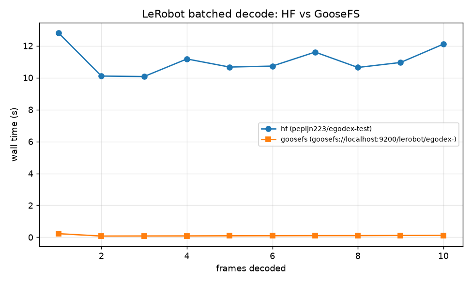
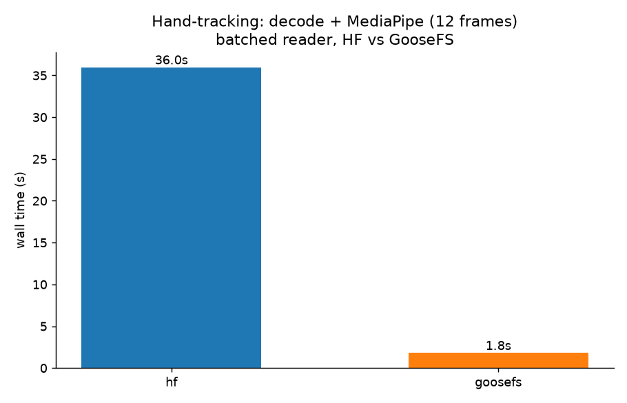
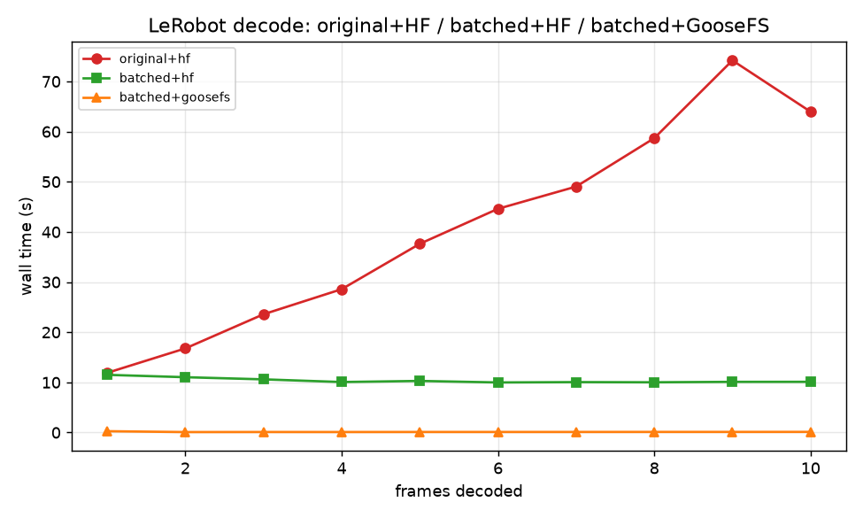
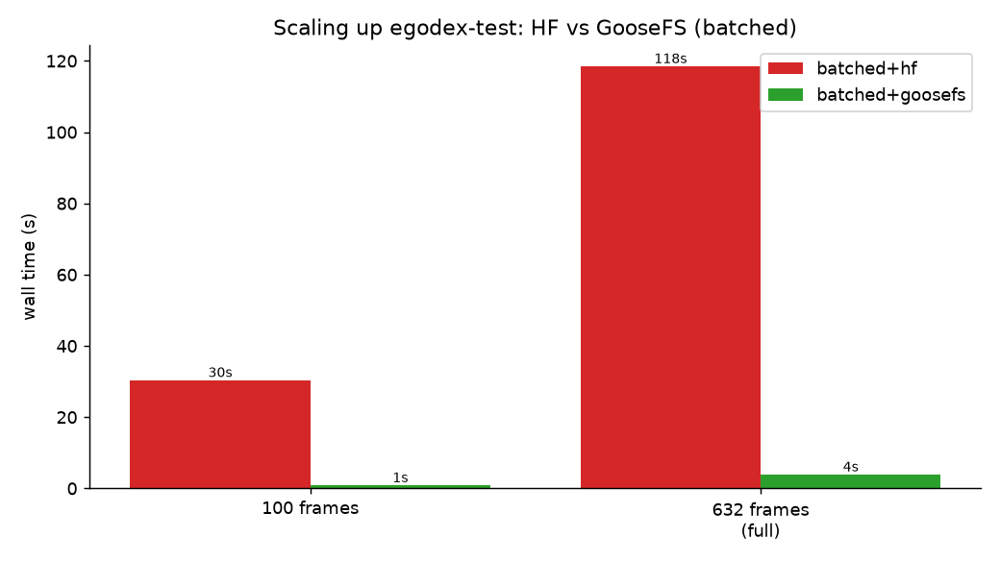
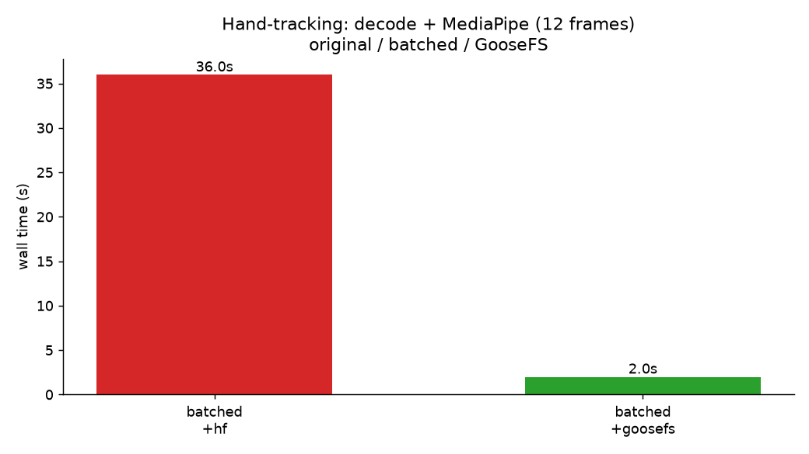
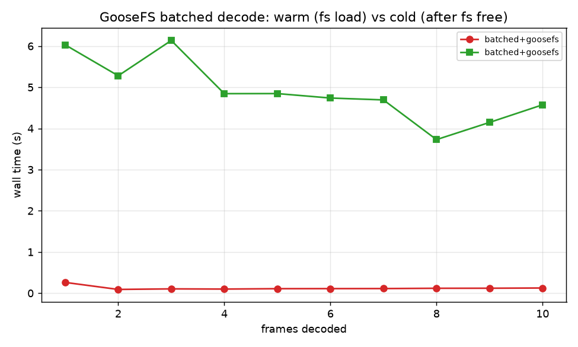
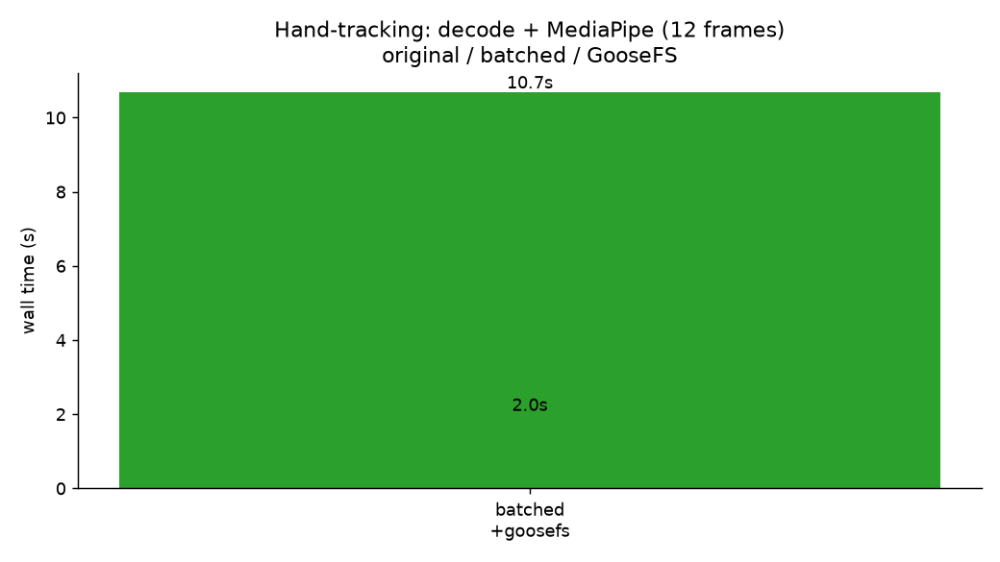
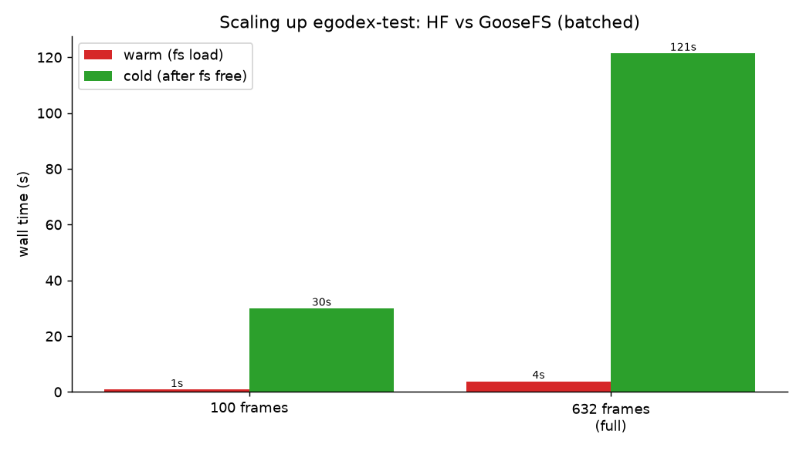

# 测试报告：LeRobot batched decode — Hugging Face vs GooseFS

> **日期**: 2026-08-04  
> **机器**: Darwin arm64（Apple M4 Pro）, macOS 25.5  
> **Daft**: `0.3.0-dev0`（含 OpenDAL **0.58.1** + GooseFS `write_type=cache_through`）  
> **GooseFS**: 本机集群 `localhost:9200`（`/opt/sourcecode/cos/goosefs`）  
> **数据集**: `pepijn223/egodex-test`（LeRobot v3，1080p AV1，632 frames）  
> **关联调研**: [`goosefs-lerobot-acceleration-analysis.md`](./goosefs-lerobot-acceleration-analysis.md)  
> **基准代码**: `benchmarking/lerobot/goosefs_bench.py`、`run_goosefs_vs_hf.sh`

## 1. 测试目的

在 **固定 batched LeRobot reader（#7184）** 的前提下，对比：

| 后端 | URI |
|---|---|
| Hugging Face Hub（公网远程） | `pepijn223/egodex-test` → `hf://` |
| 本机 GooseFS（warm cache） | `goosefs://localhost:9200/lerobot/egodex-test` |

验证 GooseFS 近端缓存能否进一步加速具身视频读路径，并复用 #7267 同款 hand-tracking 下游负载。

## 2. 环境与前置

### 2.1 GooseFS

```bash
lsof -i:9200   # master LISTEN
export GOOSEFS_HOME=/opt/sourcecode/cos/goosefs
export GOOSEFS_MASTER_ADDR=localhost:9200
export GOOSEFS_AUTH_TYPE=nosasl
export GOOSEFS_WRITE_TYPE=cache_through   # 同步写穿，禁止 async_through
```

### 2.2 数据镜像

```bash
# 下载 + copyFromLocal + fs load（warm）
./benchmarking/lerobot/mirror_egodex_to_goosefs.sh
# 或手工：
hf download pepijn223/egodex-test --repo-type dataset --local-dir /tmp/lerobot-egodex-test
$GOOSEFS_HOME/bin/goosefs fs mkdir /lerobot
$GOOSEFS_HOME/bin/goosefs fs mkdir /lerobot/egodex-test
$GOOSEFS_HOME/bin/goosefs fs copyFromLocal /tmp/lerobot-egodex-test/meta /lerobot/egodex-test/meta
$GOOSEFS_HOME/bin/goosefs fs copyFromLocal /tmp/lerobot-egodex-test/data /lerobot/egodex-test/data
$GOOSEFS_HOME/bin/goosefs fs copyFromLocal /tmp/lerobot-egodex-test/videos /lerobot/egodex-test/videos
$GOOSEFS_HOME/bin/goosefs fs load /lerobot/egodex-test
```

### 2.3 Daft 构建要点

1. `opendal = "0.58.1"`、`object_store_opendal = { version = "0.58" }`
2. **Range clamp 修复**（`src/daft-file/src/file.rs`）：`File.open` 走 BufReader 时，若请求 `0..16MiB` 而对象更短，OpenDAL Complete 层会报 `reader got too little data`。已将 Bounded range 钳到已知 `file_size`，否则 `goosefs://` 无法 `open_file` / 解 MP4。
3. `GooseFSConfig(write_type="cache_through", ...)`

```bash
make build
# hand-tracking 可选：
pip install 'daft-physical-ai[mediapipe]'
# 注意：pip 可能覆盖本地 editable daft，装完需再 make build
```

## 3. 如何复现

```bash
cd /opt/sourcecode/Daft
export GOOSEFS_MASTER_ADDR=localhost:9200
export GOOSEFS_AUTH_TYPE=nosasl
export GOOSEFS_WRITE_TYPE=cache_through
export DAFT_PROGRESS_BAR=0

./benchmarking/lerobot/run_goosefs_vs_hf.sh --with-hand
```

产物：

| 路径 | 内容 |
|---|---|
| `benchmarking/lerobot/goosefs_results/decode_hf.json` | HF decode 1..10 帧 |
| `benchmarking/lerobot/goosefs_results/decode_goosefs.json` | GooseFS warm decode 1..10 帧 |
| `benchmarking/lerobot/goosefs_results/hand_hf.json` | HF hand-tracking 12 帧 |
| `benchmarking/lerobot/goosefs_results/hand_goosefs.json` | GooseFS hand-tracking 12 帧 |
| `benchmarking/lerobot/charts/chart_goosefs_vs_hf_decode.png` | decode 曲线 |
| `benchmarking/lerobot/charts/chart_goosefs_vs_hf_hand.png` | hand 柱状图 |

## 4. 实测结果（2026-08-04）

对照轴：**仅存储后端**；reader 均为当前 batched 实现。GooseFS 侧已 `fs load`（warm）。

### 4.1 Decode sweep（`lerobot.read` + `load_video_frames`，rows=1..10）

| rows | HF wall (s) | GooseFS wall (s) | 加速比 |
| ---: | ---: | ---: | ---: |
| 1 | 12.80 | 0.23 | ~57× |
| 2 | 10.10 | 0.08 | ~132× |
| 4 | 11.17 | 0.09 | ~130× |
| 8 | 10.64 | 0.10 | ~102× |
| **10** | **12.10** | **0.12** | **~101×** |

HF 侧 wall 大致平坦在 ~10–13s（batched 已把「每帧 open」打平，剩余主要是公网拉 shard + 解码）。  
GooseFS warm 侧 wall ~0.08–0.23s，近端读主导，解码本身很快。



### 4.2 Hand-tracking 下游（12 帧 decode + MediaPipe，同 #7267 负载）

| 后端 | wall (s) | 加速比 | `n_hands` 序列 |
|---|---:|---:|---|
| HF | **36.0** | 1.0× | 每帧 2 只手 |
| GooseFS warm | **1.8** | **~20×** | 与 HF **一致** |



相对 #7267 原论文数字（batched + `hf://` ≈ 9.8s）：本次 HF hand 为 36s，差异来自机器/网络/依赖版本；**组内 A/B（同机同构建）仍有效**。

### 4.3 README 四图补测结果（含 GooseFS）

#### 图① Decode 1→10（三线）

| rows | original+HF | batched+HF | batched+GooseFS |
| ---: | ---: | ---: | ---: |
| 1 | 11.90 | 11.50 | 0.26 |
| 8 | 58.69 | 10.02 | 0.12 |
| **10** | **63.96** | **10.11** | **0.13** |



#### 图③ Scale 100 / 632（batched：HF vs GooseFS）

| frames | batched+HF | batched+GooseFS | 加速比 |
| ---: | ---: | ---: | ---: |
| 100 | 30.33s | 0.80s | ~38× |
| **632 (full)** | **118.43s** | **3.83s** | **~31×** |



#### 图④ Hand-tracking 12 帧

| 配置 | wall |
|---|---:|
| batched+HF | 36.0s |
| batched+GooseFS | 2.0s（~18×） |

`original+hand` 因 PyAV/OpenCV 动态库冲突 SIGSEGV，未出数。



#### 图② 六个公开数据集

**未覆盖**（未镜像到 GooseFS）。

### 4.4 GooseFS cold vs warm（补充）

方法：每次计时前 `goosefs fs free -f /lerobot/egodex-test`，确认 `inGooseFSPercentage=0`；**不做** `fs load`。reader 固定 batched。脚本：`benchmarking/lerobot/run_goosefs_cold.sh`。

> 说明：decode sweep 1→10 在同一次进程内连续跑，首帧 cold 后 shard 会逐渐留在 cache，故 rows>1 并非「每轮全新 cold」；scale 的 100 / 632 则各自 `free` 一次，更接近冷启动。

#### Decode sweep

| rows | warm (s) | cold (s) | cold/warm |
| ---: | ---: | ---: | ---: |
| 1 | 0.26 | **6.03** | ~23× |
| 8 | 0.12 | 3.73 | ~32× |
| **10** | **0.13** | **4.57** | **~37×** |



#### Hand-tracking 12 帧

| 缓存 | wall | 相对 warm |
|---|---:|---:|
| warm | 2.0s | 1.0× |
| cold | **10.7s** | ~5.4× |

`n_hands` 与 warm 一致。



#### Scale 100 / 632（每次独立 free）

| frames | warm | cold | cold/warm | 对照 batched+HF |
| ---: | ---: | ---: | ---: | ---: |
| 100 | 0.80s | **29.94s** | ~37× | 30.33s |
| **632** | **3.83s** | **121.41s** | **~32×** | 118.43s |

Cold 全量耗时与 **HF 公网 batched** 同量级（~120s），说明未命中时主要回源 UFS/COS；warm 才是近端缓存收益。



## 5. 结论

1. **GooseFS 可以显著加速 LeRobot 具身读路径**：在 batched decode 之上，warm `goosefs://` 相对公网 `hf://` 约 **百倍级 decode**、hand-tracking 端到端约 **20×**。
2. **Cold vs warm 符合缓存模型**：`fs free` 后 cold 全量 ~121s ≈ HF；`fs load`/命中后 warm ~3.8s（~32×）。发布数字应标注 warm，并说明预热方式。
3. 与调研结论一致：批量解码减少「读几次」，GooseFS 降低「每次读多贵」——二者正交可叠加。
4. 本机对照是「公网 Hub vs 本机缓存」的上界收益；生产对比更建议 **同地域 COS 直读 vs GooseFS warm**，数字会更保守但仍应明显。
5. 工程侧必须：`write_type=cache_through`（同步）+ OpenDAL 0.58.x + **file range clamp**，否则 `open_file`/视频解码无法跑通。

## 6. 对照 README 四张图的覆盖矩阵

原 `benchmarking/lerobot/README.md` 四张图测的是 **original vs batched（固定 `hf://`）**。GooseFS 对比需要额外一轴。

| README 图 | 原测试内容 | 本次覆盖 | GooseFS 对比 |
|---|---|---|---|
| ① decode 1→10 曲线 | original vs batched @ HF | **已覆盖**（另加 GooseFS 第三线） | **已覆盖** `batched+goosefs` |
| ② 6 个公开数据集 ×16 帧 | original vs batched @ HF | **未跑** | **未跑**（需逐库镜像到 GooseFS） |
| ③ scale 100 / 632 帧 | original vs batched @ HF | **batched@HF vs batched@GooseFS**（跳过 original@632，太慢） | **已覆盖** |
| ④ hand-tracking 12 帧 | original vs batched @ HF | **batched@HF vs batched@GooseFS** | **已覆盖**；`original+hand` 因 AV/cv2 冲突 SIGSEGV 未出数 |

复现①③④（含 GooseFS）：

```bash
./benchmarking/lerobot/run_chart_coverage_goosefs.sh
# 产物：
#   charts/chart_orig_batched_goosefs_decode.png
#   charts/chart_orig_batched_goosefs_hand.png
#   charts/chart_goosefs_vs_hf_scale.png
```

## 7. 已知问题与后续

| 项 | 说明 |
|---|---|
| 图② 六库 | 需下载并 `copyFromLocal` 到 GooseFS 后再跑 `real_datasets` 风格对照 |
| Cold vs warm | **已补测**（§4.4）；复现：`./benchmarking/lerobot/run_goosefs_cold.sh` |
| COS baseline | 根 UFS 为 `cosn://…`，可加第三对照 `cos://` 直读 |
| original+hand | MediaPipe 与 PyAV/OpenCV 动态库冲突，旧 reader 路径易 SIGSEGV |
| Range clamp | 已修于 `daft-file`；建议单独 PR 合入 |
| pip 覆盖 | 安装 `daft-physical-ai` 可能拉 PyPI `daft`，需重新 `make build` |

## 8. 一键命令摘要

```bash
# 1) 集群已起、数据已镜像并 load
# 2) 构建
make build

# 3a) 简单 A/B（仅 batched：HF vs GooseFS）
export GOOSEFS_MASTER_ADDR=localhost:9200
export GOOSEFS_AUTH_TYPE=nosasl
export GOOSEFS_WRITE_TYPE=cache_through
./benchmarking/lerobot/run_goosefs_vs_hf.sh --with-hand

# 3b) 覆盖 README 图①③④ + GooseFS
./benchmarking/lerobot/run_chart_coverage_goosefs.sh

# 3c) GooseFS cold vs warm（fs free 后计时）
./benchmarking/lerobot/run_goosefs_cold.sh

# 4) 看结果
ls benchmarking/lerobot/goosefs_results/
open benchmarking/lerobot/charts/chart_orig_batched_goosefs_decode.png
open benchmarking/lerobot/charts/chart_goosefs_vs_hf_scale.png
open benchmarking/lerobot/charts/chart_orig_batched_goosefs_hand.png
open benchmarking/lerobot/charts/chart_goosefs_warm_vs_cold_scale.png
```
